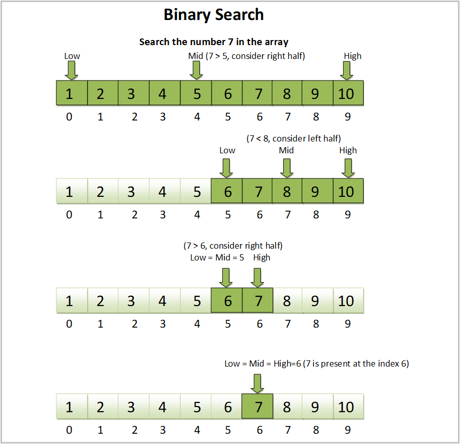

#  Understanding Binary Search

## Introduction

Binary search is a highly efficient algorithm used for finding an element in a sorted array by repeatedly dividing the search interval in half. This lesson explores how binary search operates, its implementation details, and why it is more efficient than linear search methods in certain scenarios.

## Learning Objectives

By the end of this lesson, students will be able to:

- Explain the concept and operational mechanics of the binary search algorithm.
- Implement the binary search algorithm in code.
- Understand the conditions under which binary search can be applied (i.e., the array must be sorted).

## Lesson Overview (60 minutes)

1. [Concept of Binary Search](#Concept-of-Binary-Search)
2. [Implementing Binary Search](#Implementing-Binary-Search)
3. [Exercise: Binary Search Implementation](#Exercise-Binary-Search-Implementation)
4. [Summary and Takeaways](#Summary-and-Takeaways)

## Concept of Binary Search

The idea behind the binary search is that we can first divide the array into two halves, and compare the element we’re
searching for (call it `x` ) with the element in the middle (call it `m`) that divides the two halves of the array.
Since the array is sorted, we know that `if x > `m, then we only need to continue searching in the right half of the
original array because the list is given to be sorted. If `x < m`, then we only need to continue searching in the left
half of the original array. We can recursively continue this process until either the value is found, or if the interval
is empty meaning that `x` was not in our original array. For example, let’s say that we were searching for whether `-1`
was in the array shown above. A visual diagram of how binary search would work is:



### Visualization
Imagine an array of integers sorted in ascending order. To find a specific value, binary search would proceed as follows:

- First, compare the target value with the middle element.
- If the target value is higher, ignore the left half of the array. If lower, ignore the right half.
- Repeat the process on the new half-array until the target is found or the subarray is empty.

## Implementing Binary Search

To implement binary search, follow these steps:

1. **Ensure the Array is Sorted**: Confirm that the array is sorted in ascending or descending order. If not, sort the
   array using a suitable sorting algorithm. The order of sorting affects the direction of comparison in the search
   steps.
2. **Initialize Pointers**: Set the initial positions for the lower (`low`) and upper (`high`) bounds of the search.
   Typically, `low` is initialized to `0` (the start of the array) and `high` is set to `array.length - 1` (the end of
   the array).
3. **Locate the Middle Element**: While the low pointer is less than or equal to the high pointer:
    - Calculate the middle position, `mid`, typically with `mid = low + (high - low) / 2` to avoid potential overflow.
    - Compare the middle element with the target value.
4. **Check for Match**:
    - If the middle element matches the target, return the index of this element.
    - If the target value is greater than the middle element (for ascending order), adjust the `low` pointer
      to `mid + 1`.
    - If the target value is less than the middle element, adjust the `high` pointer to `mid - 1`.
5. **Repeat or Exit**: Continue adjusting the `low` and `high` pointers and recalculating the middle until the target is
   found or until the pointers indicate that the target is not in the array (i.e., when low exceeds high).
6. **Return Result**: If the loop exits without a match, return `-1` or some indicator that the target value is not
   present in the array.

## Implementation in Java

Here’s what the implementation of a binary search looks like in Java:

### Binary Search Definition

```java
public class BinarySearch {
    /**
     * Performs a binary search on a sorted array to find a specific element.
     *
     * @param array - Sorted array of integers.
     * @param x     - Target number to search for.
     * @param low   - Starting index to search from.
     * @param high  - Ending index to search to.
     * @return The index of the target element if found, otherwise -1.
     */
    int binarySearch(int[] array, int x, int low, int high) {
        if (high >= low) {
            int mid = low + (high - low) / 2;  // This prevents potential overflow.
            if (array[mid] == x) {
                return mid;
            } else if (x < array[mid]) {
                return binarySearch(array, x, low, mid - 1);
            } else {
                return binarySearch(array, x, mid + 1, high);
            }
        }
        return -1;
    }
}
```

### Usage Example

```java
public class BinarySearchDemo {
    public static void main(String[] args) {
        int[] array = {2, 4, 6, 8, 10, 12};
        BinarySearch binarySearch = new BinarySearch();
        int result = binarySearch.binarySearch(array, 4, 0, array.length - 1); // Corrected the upper index limit
        if (result == -1) {
            System.out.println("The Element is not found in the array");
        } else {
            System.out.println("The Element is found in the array at index " + result);
        }
    }
}
```

## Exercise: Binary Search Implementation
Implement binary search in a programming language of your choice using the above algorithm. Test your function with the following array and values:
- Array: [3, 6, 8, 12, 14, 18]
- Values to search: 14, 7

**Discuss with peers:**
- What happens when the searched value is not in the array?
- How does the efficiency of binary search compare to linear search? 

## Summary and Key Takeaways

### Summary

Binary search is a highly efficient algorithm for finding an element in a sorted array by repeatedly dividing the search
interval in half. It starts by comparing the target value with the middle element of the array. Depending on whether the
target is greater or less than the middle element, it discards one half of the array and continues the search on the
other half. This process is repeated until the element is found or the subarray has been narrowed down to zero elements,
indicating that the target is not present in the array.

### Key Takeaways

- **Prerequisite for Sorting**: The array must be sorted for binary search to be applicable. If the array is not sorted,
  it must be sorted first, which can be achieved using any standard sorting algorithm.
- **Efficiency**: Binary search is much more efficient than linear search for large datasets because it reduces the
  problem size by half with each step, leading to a time complexity of `O(log n)`.
- **Implementation**: The process involves finding the middle element of the array, comparing it with the target value,
  and then focusing the search on the half of the array that could contain the target based on the comparison result.
- **Recursion or Iteration**: Binary search can be implemented using either a recursive approach or an iterative
  approach, both following the same basic principle of halving the search space.
- **Handling of Edge Cases**: It's crucial to handle edge cases such as when the array has only one element or when the
  target value is not present in the array.
- **Adaptability**: While traditionally used for arrays, the principles of binary search can be adapted for other sorted
  data structures and various practical applications, such as finding a number in a sorted matrix or determining the
  point of change in a bitonic sequence.
