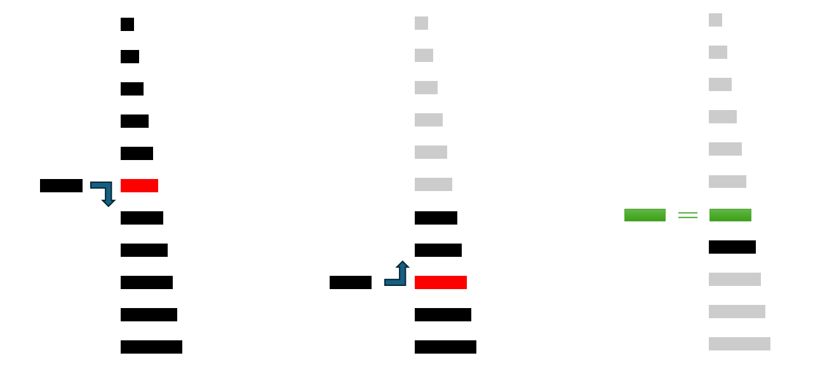

<h1>
  <span class="headline">Binary Search in Java</span>
  <span class="subhead">Binary Search</span>
</h1>

**Learning objective:** By the end of this lesson, you'll be able to explain what a binary search algorithm is.

## Binary search algorithm
Binary search is an efficient algorithm for finding a target value within a sorted array. It works by repeatedly dividing the search interval in half.

### Prerequisites for a binary search
- The data structure must be sorted.
- Access to any element of the data structure should take constant time.

### Steps
1. As inputs, get the sorted search space (linear data structure) and the **target**, the value whose position needs to be searched and found.
1. Divide the search space into two halves by finding the middle index **mid**. 
2. Compare the middle element of the search space with the **target**. 
3. If the target is found at middle element, the process is terminated.
4. If the target is not found at middle element, choose which half will be used as the next search space.
     - If the target is smaller than the middle element, then the left side (_side with values **lesser than mid** in an ascending sorted list_) is used for next search.
     - If the target is larger than the middle element, then the right side (_side with values **greater than mid** in an ascending sorted list_)is used for next search.
5. This process is continued until the target is found or the total search space is exhausted.
6. If the target is found, Output the position. If the target is not found, output the message that the value doesn't exist.



### Pseudocode
```plaintext
INPUT array, target 
SET search_index_lower_limit = 0
SET search_index_higher_limit = length(array) - 1
WHILE search_index_lower_limit <= search_index_higher_limit:
    SET mid = (search_index_lower_limit + search_index_higher_limit) // 2
    IF array[mid] == target:
        OUTPUT mid
		STOP the execution
    ELSE IF array[mid] < target:
        SET search_index_lower_limit = mid + 1
    ELSE:
        SET search_index_higher_limit = mid - 1
OUTPUT "Target not Found"
STOP the execution
```
## Time complexity of binary search algorithms
At each binary search step, the number of searched items in a list is reduced by half. This means that the time it takes to search for an element in a sorted array grows slowly as the size of the array increases. Hence, the time complexity of the binary search algorithm is \(O(logn)\), where \(n\) is the number of elements in the array. 

## Advantages of binary search algorithms
1. Binary search is faster than linear search, especially for large arrays.
2. The time taken depends only on the size of the dataset, irrespective of the position of the target value.

## Limitations of binary search algorithms
1. Binary search cannot be applied to unsorted arrays directly. If the data is not sorted beforehand, there is an  overhead of additional computational costs of sorting the array, that needs to be considered. 
2. Binary search is efficient only for linear data structures stored in contiguous memory location and accessible by index. It is inefficient for non-contiguous memory data structures like linked lists. Even though, they could be sorted, the average time complexity of accessing an element increases with the size of the data structure.

## Final reflections
1. Binary Search in an efficient search algorithm with a time complexity of \(O(logn)\).
2. It compares the target value to the middle element of a sorted array. If they are equal, the search is successful. If the target is less than the middle element, the search continues in the lower half of the array. If the target is greater, the search continues in the upper half. This process repeats until the target is found or the search scope is exhausted.
